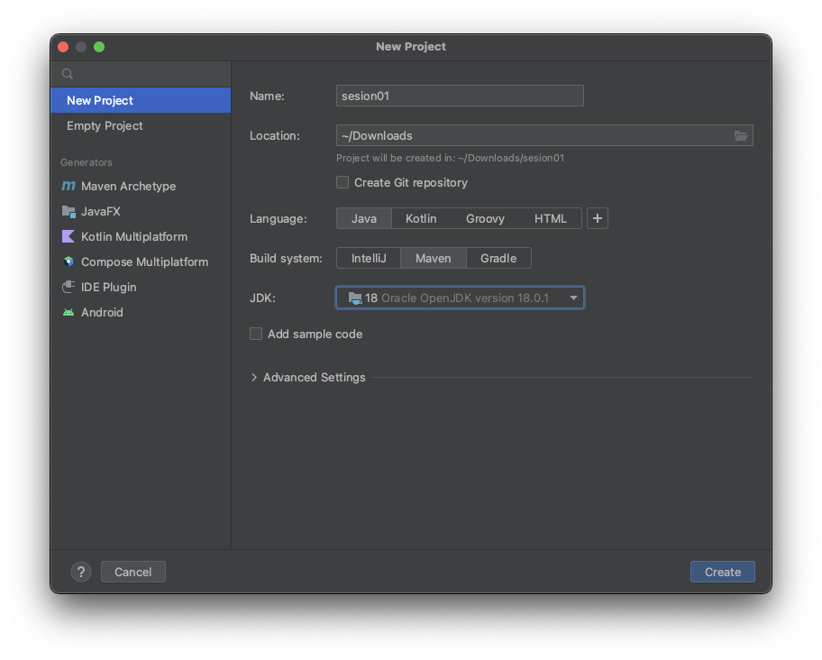
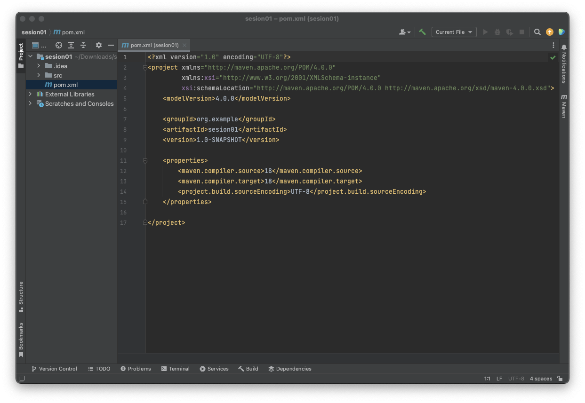

## Ejemplo 01: Tareas personalizadas

### OBJETIVO

- Crear un archivo `pom.xml`
- Entender la organización de los proyectos con **Maven**

### DESARROLLO

1. Abrimos el IDE **intelliJ IDEA** y seleccionamos la creación de un nuevo proyecto.

2. Seleccionamos la siguiente configuración del proyecto:



Es importante notar que como sistema de construcción se eligió a **Maven**

3. Con esto, nuestro IDE nos crea un proyecto completo en el que ya viene el archivo de configuración de **Maven**.

4. Abrimos el archivo `pom.xml` que debe verse como el de la siguiente imagen.



En este archivo se puede ver la configuración completa del proyecto, en donde podemos encontrar el nombre del proyecto en la sección:

```xml
  <artifactId>sesion01</artifactId>
```

Y también otras propiedades de compilación y construcción como:

```xml
    <properties>
        <maven.compiler.source>18</maven.compiler.source>
        <maven.compiler.target>18</maven.compiler.target>
        <project.build.sourceEncoding>UTF-8</project.build.sourceEncoding>
    </properties>
```

En donde indica que se usa la versión 18 de Java y una codificación de texto `UTF-8`.

5. **Maven** define que todo proyecto Java, ya sea para construir una biblioteca o para una aplicación, debe tener la siguiente estructura de directorios en el sistema de archivos:

- `pom.xml`: archivo de descripción, ubicado en la raíz del proyecto. En él se indica su nombre, la ubicación que tendrá éste en el repositorio de binarios, las dependencias que necesita para compilar, para ejecutar o para lanzar los test. También se especifica si se hará uso de plugins.

- `src/main/java`: directorio en donde se ubicarán los archivos Java del proyecto que serán compilados y formarán parte del binario resultante. A partir de ese directorio es donde se tendrán en cuenta los paquetes de los archivos Java. Por ejemplo, el archivo fuente de la clase `org.proyecto.Persona` se ubicará en `src/main/java/org/proyecto/Persona.java`.

- `src/main/resources`: permite añadir recursos que también se incorporarán dentro del binario resultante, pero que no deben ser compilados. Por ejemplo, los archivos con extensión .properties, XML o imágenes.

- `src/test/java`: directorio para colocar las fuentes Java que únicamente se usarán en la ejecución de los test unitarios. El contenido de este directorio no será empaquetado en el binario final.

- `src/test/resources`: necesario si para la ejecución de los test se utilizan otros recursos como archivos XML o CSV con datos de prueba para verificar los algoritmos. Los archivos incluidos no serán empaquetados en el archivo final.

- `target/classes`: en este directorio se almacenarán las clases Java resultantes de la compilación de las fuentes almacenadas en `src/main/java`
.
- `target/<proyecto.jar>`: típicamente los proyectos generarán un binario con el contenido de `target/classes` más `src/main/resources` en un único archivo empaquetado con extensión jar. Si el proyecto es una aplicación, éste contendrá además todas las dependencias dentro de él para que se disponga de todo lo necesario a la hora de ejecutar la aplicación, formando un archivo denominado fat-jar.

Prácticamente todos los editores de programación de Java trabajan perfectamente con los proyectos organizados como indica **Maven**. Se puede considerar que se ha convertido en un estándar de facto. Los editores automáticamente procesan el archivo `pom.xml` para tener presente las dependencias necesarias y ajustar la configuración del proyecto acorde con lo especificado en el archivo.