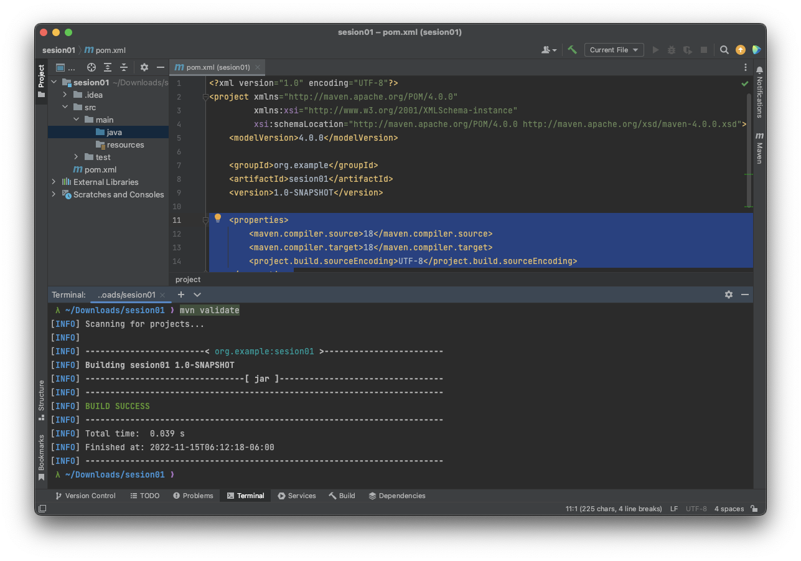
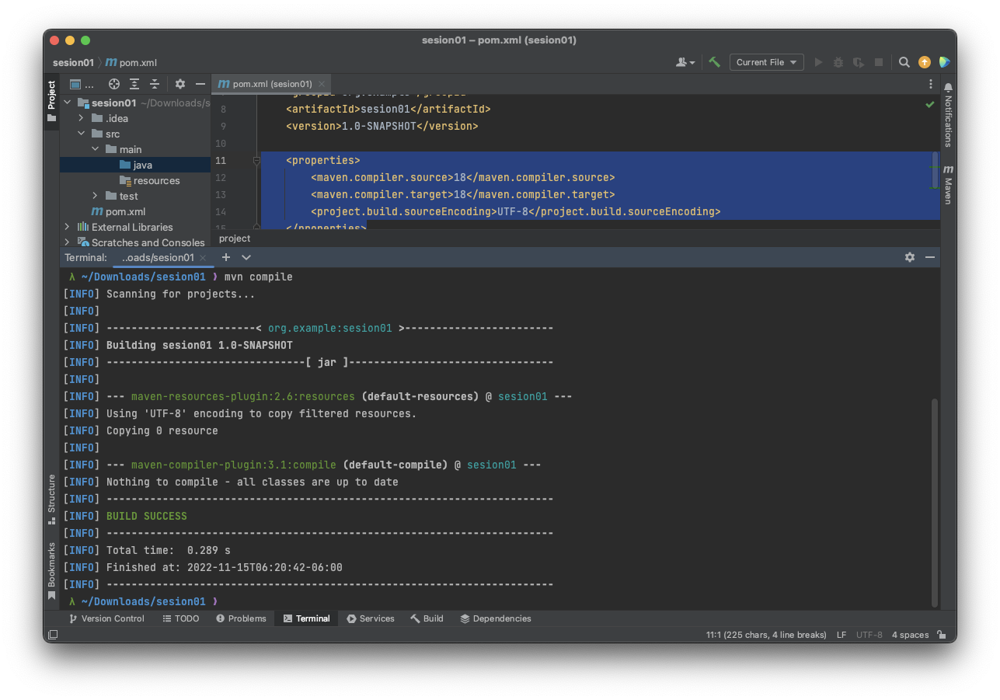
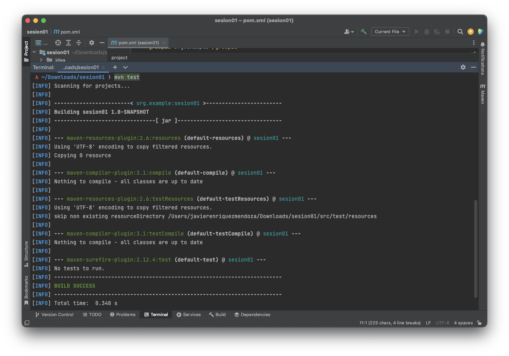
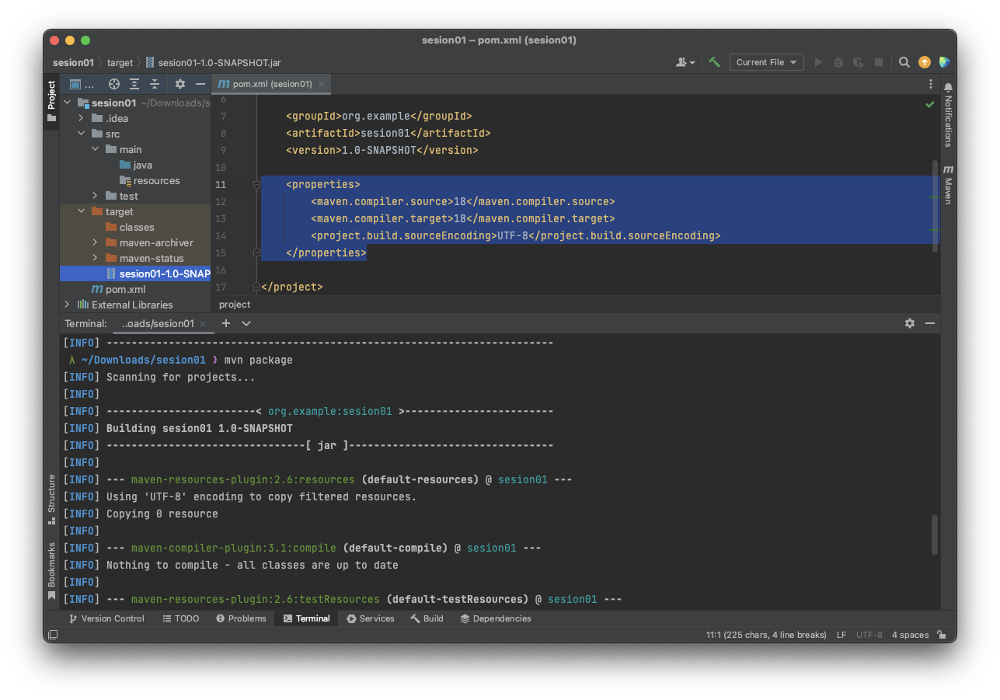

## Ejemplo 02: Fases de Construcción

### OBJETIVO

- Compilar un archivo con código en lenguaje Java a través de **Maven**.

### DESARROLLO 

Para este ejemplo estaremos trabajando con el mismo proyecto que en la sesión anterior para estudiar las fases de construcción de un proyecto usando **Maven**.

Una vez definido cómo deben organizarse los archivos fuente que constituyen un proyecto, el siguiente paso es invocar a **Maven** para que pueda realizar el proceso de construcción del proyecto. **Maven** tiene presente las dependencias entre módulos que puede haber, así que si se trata de un proyecto modular, el orden de construcción de los módulos se realizará en el orden correcto que permita satisfacer las dependencias. La construcción de cada módulo individual se realiza de la misma manera que se hace sobre un proyecto simple. Por tanto, ya sea para un módulo o para un proyecto simple, **Maven** tratará de construir el módulo o proyecto, pasando siempre por las siguientes fases en el orden que se indica:

- **validate**: valida que el proyecto es correcto y que toda la información necesaria está disponible según la especificación de los POMs.

- **compile**: compila el código fuente del proyecto revisando todos los directorios `src/main/java`, alojando los archivos .class en `target/classes`.

- **test**: prueba el código fuente compilado utilizando el marco de prueba unitario indicado en el POM, normalmente JUnit. En esta fase se lanza la ejecución de todos los test. Si el resultado de alguno de ellos no es correcto se interrumpe la construcción.

- **package**: recoge el código compilado y lo empaqueta en su formato distribuible, normalmente como un archivo del tipo `<application>.jar`.

  

- **verify**: ejecuta cualquier comprobación de los resultados de las pruebas de integración para garantizar que se cumplan los criterios de calidad.

- **install**: instala el paquete en el repositorio local, para usarlo como dependencia en otros proyectos locales.

- **deploy**: copia el binario construido en el repositorio remoto, para compartirlo con otros desarrolladores y proyectos. Esta fase requiere que se indique la URL del repositorio donde desplegar, así como también las credenciales a usar en caso necesario.

- **clean**: (opcional) Si se invoca manualmente, **Maven** eliminará todos los recursos generados durante la compilación y el empaquetado, borrando el directorio target.

- **site**: (opcional) produce un informe en HTML acerca del proyecto mostrando la documentación del API de Javadoc y estadísticas según las herramientas de análisis que se hayan configurado.

En la mayoría de las veces será suficiente con lanzar la ejecución de **Maven** parando en algún momento anterior al **deploy** si se trabaja localmente. Por ejemplo, en muchas ocasiones bastará con ejecutar **package** si es una aplicación simple o **install** si se trata de la actualización de algún módulo usado por otra aplicación.

> Nota: Sea cual sea la fase indicada, si pasa por package, **Maven** dejará disponible el binario localmente ubicado en el directorio target del proyecto o módulo correspondiente. 

