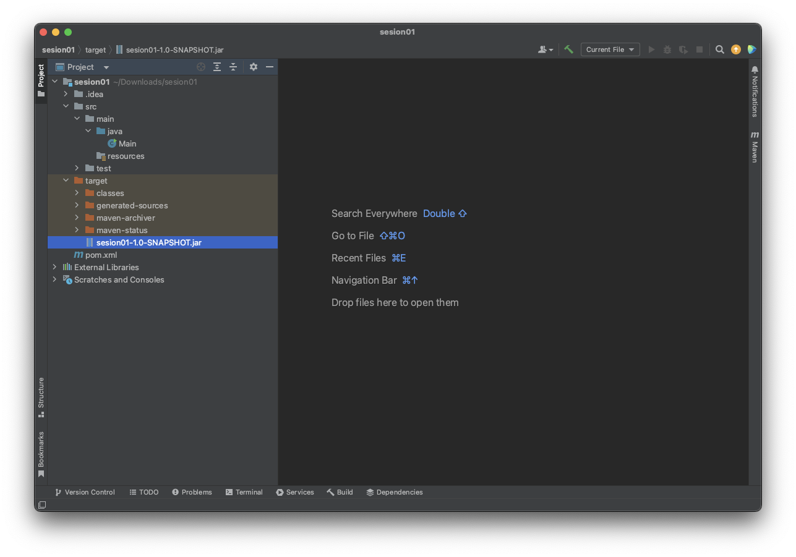
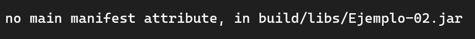
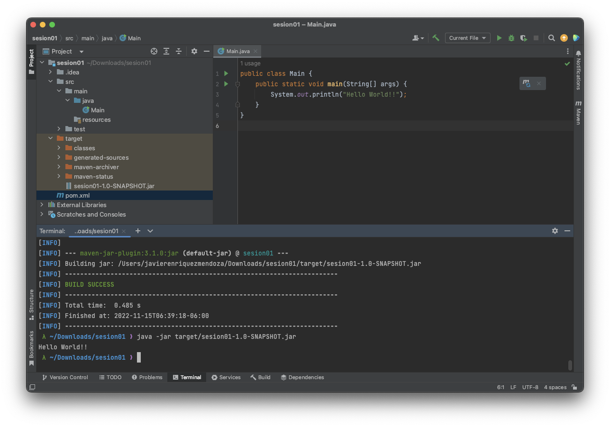

## Ejemplo 03: Ejecutar el JAR generado por Maven

### OBJETIVO

- Ejecutar de manera satisfactoria el JAR generado por Maven

### DESARROLLO

En el ejercicio anterior pudimos compilar un archivo Java usando **Maven**... ¿notaste algo más al ejecutar el comando `mvn package`? 🤔

Además de compilar nuestro código, Maven genera una carpeta llamada **target** que entre muchas cosas contiene el archivo JAR resultado de compilar nuestro código Java:



> 💡 *Nota: El JAR resultante tendrá el nombre de la carpeta que contenga el archivo build.Maven.*

Vamos a crear una nueva clase en `src/main/jana` con el nombre `Main` y agregaremos el siguiente código:

```java
public class Main {
    public static void main(String[] args) {
        System.out.println("Hello World!!");
    }
}
```

Ahora lo compilamos 

```bash
mvn package
```

Si queremos ejecutar cualquier archivo JAR basta con ejecutar el comando 

```bash
java -jar archivo.jar
```

Pero lamentablemente si ejecutamos el JAR generado por Maven obtendremos el siguiente resultado:



¿Qué salió mal? 😫😭

Básicamente el JAR generado no contiene la referencia de la clase principal, por lo tanto modificaremos el archivo `pom.xml` para incluir las siguientes líneas:

```xml
<build>
        <plugins>
            <plugin>
              <groupId>org.apache.maven.plugins</groupId>
                <artifactId>maven-jar-plugin</artifactId>
                <version>3.1.0</version>
                <configuration>
                    <archive>
                        <manifest>
                          <mainClass>Main</mainClass>
                        </manifest>
                    </archive>
                </configuration>
            </plugin>
        </plugins>
    </build>
```

Con esto especificamos que el JAR generado al momento de ejecutar el comando `mvn package` utilice la clase `Main` como clase principal en su ejecución.

Por último ejecutaremos nuevamente el comando `mvn package` para generar nuevamente el archivo JAR y al ejecutar el JAR obtendremos el siguiente resultado:

