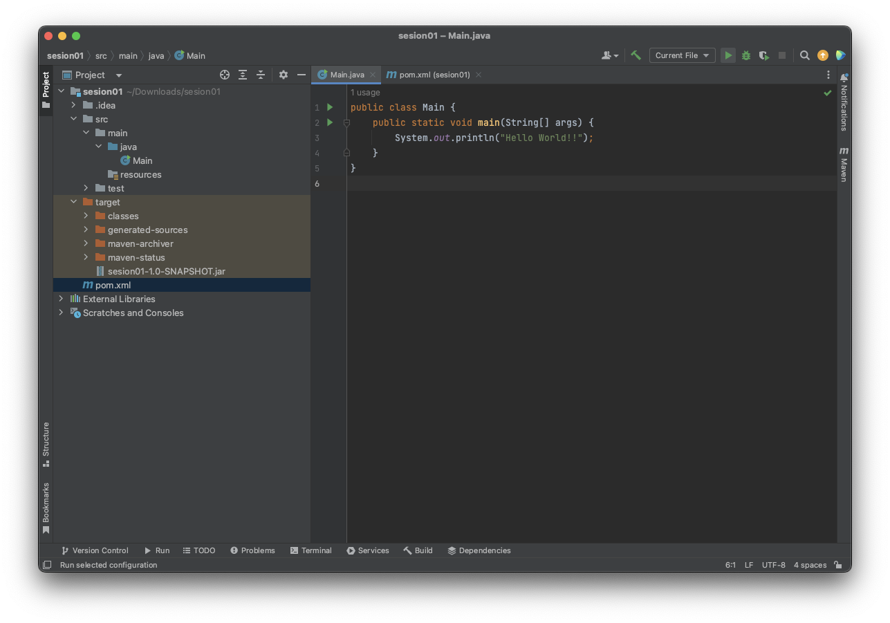
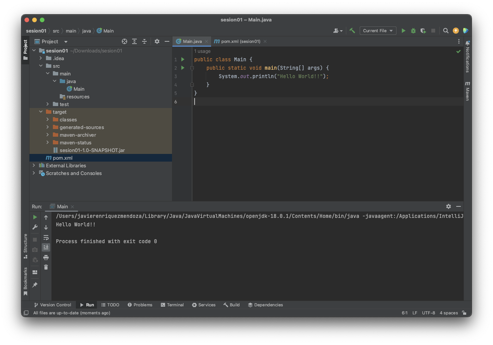

## Ejemplo 04: Compilando y Ejecutando aplicaciones Java

### OBJETIVO

- Compilar y ejecutar una aplicación de Java a IntelliJ

### DESARROLLO

En el ejercicio anterior logramos poder ejecutar el JAR que genera **Maven** pero a pesar de eso el proceso para correr un programa sigue siendo bastante complicado... ¿existirá alguna forma de hacerlo más simple? 😫

Afortunadamente nuestro IDE se encarga de hacer todo el trabajo por nosotros para que no tengamos que hacerlo paso por paso.

Usaremos el mismo proyecto que en el ejemplo anterior, solo verifica que el archivo `pom.xml` tenga la siguiente estructura:

```xml
<?xml version="1.0" encoding="UTF-8"?>
<project xmlns="http://maven.apache.org/POM/4.0.0"
         xmlns:xsi="http://www.w3.org/2001/XMLSchema-instance"
         xsi:schemaLocation="http://maven.apache.org/POM/4.0.0 http://maven.apache.org/xsd/maven-4.0.0.xsd">
    <modelVersion>4.0.0</modelVersion>

    <groupId>org.example</groupId>
    <artifactId>sesion01</artifactId>
    <version>1.0-SNAPSHOT</version>

    <properties>
        <maven.compiler.source>18</maven.compiler.source>
        <maven.compiler.target>18</maven.compiler.target>
        <project.build.sourceEncoding>UTF-8</project.build.sourceEncoding>
    </properties>

    <build>
        <plugins>
            <plugin>
              <groupId>org.apache.maven.plugins</groupId>
                <artifactId>maven-jar-plugin</artifactId>
                <version>3.1.0</version>
                <configuration>
                    <archive>
                        <manifest>
                          <mainClass>Main</mainClass>
                        </manifest>
                    </archive>
                </configuration>
            </plugin>
        </plugins>
    </build>

</project>
```

Después de eso iremos a la clase `Main` y seleccionaremos el botón de play verde en la barra superior del IDE



este botón hará el proceso de compilación internamente y ejecutará nuestro archivo obteniendo el mismo resultado.


