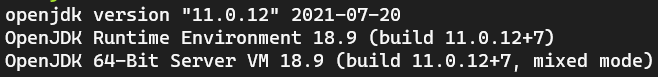
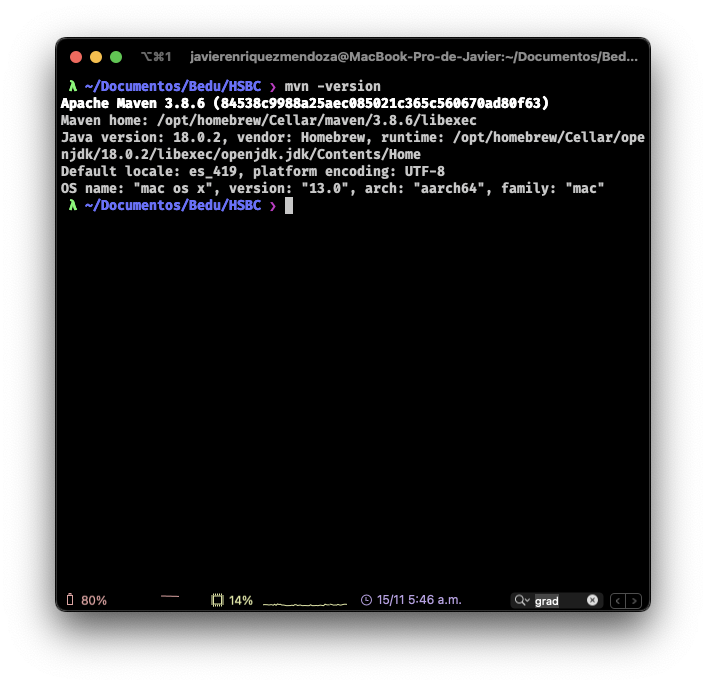
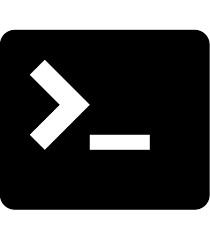

## Sesión 1: Construcción de proyectos con Maven 

<!--  -->

 
### 1. Objetivos :dart:

- Aprender el uso de la herramienta Maven para construir y ejecutar proyectos en lenguaje Java.

### 2. Contenido :blue_book:

#### 👀 Antes de comenzar...

Debemos verificar que nuestro equipo tenga correctamente instalado **Java** y **Maven**:

- Para verificar la versión instalada de **Java** ejecuta el comando `java -version`:

*Nota: Usaremos la versión 11 de Java aunque puedes usar la más reciente.*

- Para verificar la versión instalada de **Maven** ejecuta el comando `mvn -version`:

*Nota: Usaremos la versión 3 de Maven aunque puedes usar la más reciente.*

En este módulo aprenderemos:
- Creación de archivo de configuración de **Maven**
- Compilación de código Java usando Maven
- Ejecución de programas en código Java usando Maven
- Instalación y uso de plugins de Maven

---

#### <ins>Tema 1: ¿Qué es Maven?</ins>

Maven es una herramienta desarrollada en Java que simplifica las tareas de compilación y construcción de aplicaciones de software, principalmente usado con lenguajes de programación que tienen como destino ser ejecutadas en la Java Virtual Machine (JVM). Además, incorpora una gestión de dependencias madura con acceso a los repositorios públicos de Maven con más de 16 Millones de librerías disponibles incluyendo todas las versiones de cada una de ellas.

Los proyectos que usan **Maven** como herramienta de construcción tienen un archivo de configuració  llamado `pom.xml`. En el que se definen todos los parámetros del uso de **Maven**

Comenzaremos con el [primer ejemplo](./Ejemplo-01) creando Un proyecto de Java que use **Maven**.

- [**`EJEMPLO 1`**](./Ejemplo-01)

---

#### <ins>Tema 2: Compilación y ejecución con Maven.</ins>

Ahora que conocemos el uso general de Maven, veremos cómo usarlo para el desarrollo de aplicaciones Java. En el [segundo ejemplo](./Ejemplo-02) lo usaremos para compilar una aplicación desde línea de comandos.

Es aquí donde tendrás tu [primer reto](./Reto-01) en el que tendrás que escribir tu primera aplicación, compilarla y generar un archivo `.jar`.

- [**`EJEMPLO 2`**](./Ejemplo-02)
- [**`EJEMPLO 3`**](./Ejemplo-03)
- [**`Reto 1`**](./Reto-01)

---

 

#### <ins>Tema 3: Compilación y ejecución de aplicaciones Javas.</ins>

Aquí aprenderás como compilar y ejecutar tu aplicación sin tener que generar el archivo `.jar` explicitamente. 

- Compilación y ejecución de aplicaciones Java

- [**`EJEMPLO 4`**](./Ejemplo-04)
- [**`Reto 2`**](./Reto-02)

---

<!-- ### 3. Postwork :memo:

Encuentra las indicaciones y consejos para reflejar los avances de tu proyecto de este módulo.
 
- [**`POSTWORK SESIÓN 1`**](./Postwork/) -->
  
 

