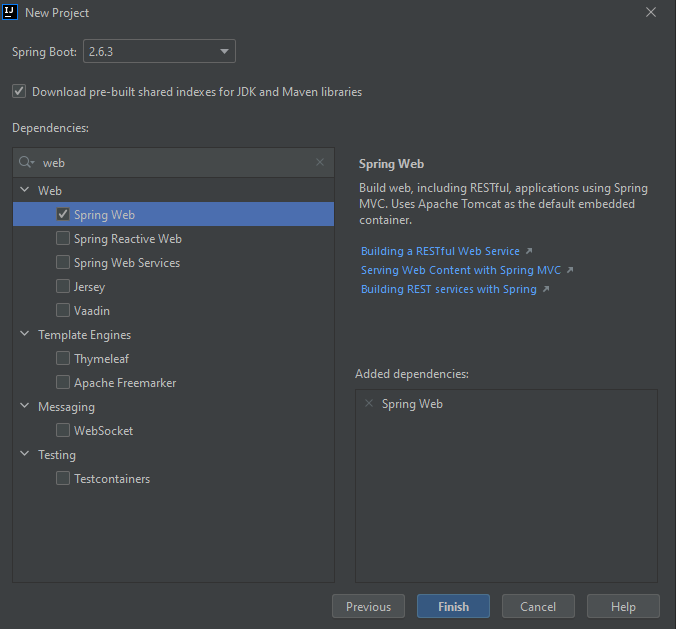
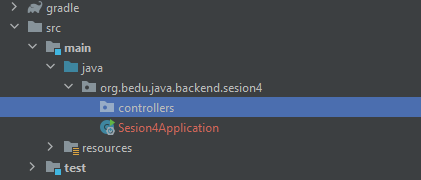
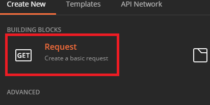

## Ejemplo 02: Controladores de lectura con Spring MVC

### OBJETIVO

- Aprender la forma de crear controladores de Spring usando su módulo web (Spring MVC).
- Crear un primer servicio REST que regrese un recurso estático.
- Consumir el servicio usando un navegador Web y con Postman.

### DESARROLLO

Una API utiliza ciertos protocolos para permitir la comunicación entre aplicaciones programadas en diferentes lenguajes de programación. Bien, acá es donde entran los servicios web, una tecnología que utiliza un conjunto de estándares y protocolos para intercambiar datos entre aplicaciones. En este sentido tenemos dos términos que usualmente son utilizados como sinónimos: REST y RESTful, estos definen características y/o principios de diseño que se deben seguir para programar servicios web.

Es importante conocer e implementar bien estos principios de diseño para crear una API con las características necesarias para ser considerada RESTful. ¿Cómo sabemos que tan bien se implementan estos principios? El modelo de madurez de Richardson establece niveles para saber qué tan RESTful es una API. Van desde el nivel 0 hasta el nivel 3 donde el nivel 3 es el de mayor grado de madurez. 


RESTful, por su lado, define un conjunto de características con las que debe cumplir un servicio REST. RESTful no solo indica que se debe cumplir con la arquitectura REST, sino también los tipos de operaciones y métodos HTTP que se deben implementar en cada operación para poder llevar a cabo un correcto manejo de los recursos (la información manejada para el software que expone los servicios RESTful).

Las características de los servicios web RESTful:

- Están asociados a la información.
- Tiene cinco operaciones típicas: listar, crear, leer, actualizar y borrar.
- Para las operaciones anteriores necesita de un método URI y HTTP.
- El URI es un sustantivo que contiene el nombre del recurso.
- El método HTTP es un verbo.
- Suelen regresar la información en formato JSON.
- Retornan códigos de respuesta HTML.


Spring MVC es el módulo de Spring que se encarga del manejo de peticiones HTTP (el protocolo que se usa en los servicios web REST). El framework define una serie de interfaces que siguen el patrón de diseño Strategy para todas las responsabilidades que deben ser manejadas por el framework. El objetivo de cada interface es ser simple y clara, para que sea fácil para los usuarios de Spring MVC (o sea, nosotros) crear nuestras propias implementaciones.

En este ejemplo implementarás tu primer controlador REST usando Spring MVC.

#### Implementación

Crea un proyecto usando Spring Initializr desde el IDE IntelliJ Idea como lo hiciste en la primera sesión. Selecciona las siguientes opciones:

    Grupo, artefacto y nombre del proyecto.
    Tipo de proyecto: **Maven**.
    Lenguaje: **Java**.
    Forma de empaquetar la aplicación: **jar**.
    Versión de Java: **11** o superior.


En la siguiente ventana elige Spring Web como la única dependencia del proyecto:



Presiona el botón `Finish`.

Dentro del paquete del proyecto crearemos un subpaquete que contendrá los controladores de Spring MVC (los componentes que reciben y manejan las peticiones web dentro de la aplicación).

Haz clic con el botón derecho del ratón sobre el paquete y en el menú que se muestra selecciona las opciones `New  -> Package`. Dale a este nuevo paquete el nombre de `controllers`.



Crea un segundo paquete llamado `model` a la misma altura que el paquete `controllers`. Al final debes tener dos paquetes adicionales:


Dentro del paquete `model` crea una nueva clase llamada `Saludo`. Esta clase representará el modelo de los datos que regresará el servicio que crearemos en un momento. Esta será una clase sencilla que solo tendrá una propiedad de tipo `String`: `mensaje`. Además de esta propiedad la clase debe tener su método *setter* y su método *getter*:    

```java
public class Saludo {
    private String mensaje;

    public String getMensaje() {
        return mensaje;
    }

    public void setMensaje(String mensaje) {
        this.mensaje = mensaje;
    }
}
```

Cuando alguien invoque esta clase le regresaremos una instancia nueva de esta clase con un valor establecido en su atributo mensaje. Este diseño se puede mejorar, pero para este ejemplo servirá.

En el paquete `controller` crea una nueva clase llamada `SaludoController`. Esta clase implementará los servicios web REST que manejan a los recursos de tipo `Saludo`. Para indicar a Spring que este componente es un servicio REST debemos decorar la case con la anotación `@RestController`:

```java
@RestController
public class SaludoController {

}
```

Esta clase tendrá, en este momento, un  solo método o manejador de llamadas, el cual no recibirá ningún parámetro y regresará un recurso de tipo `Saludo` con un mensaje preestablecido.

```java
    public Saludo saluda(){

        Saludo saludo = new Saludo();
        saludo.setMensaje("¡¡Hola Mundo!!");

        return saludo;
    }
```

Para indicar que este método es un manejador de peticiones debemos indicar qué tipo de operaciones manejará (el verbo HTTP que soportará). Como en este caso solo se usará para leer información estática se usará el verbo **GET**. Spring en su módulo web (Spring MVC) proporciona una serie de anotaciones que permite indicar esto de una forma sencilla. En este caso la anotación que se usrá es `@GetMapping` a la cual hay que indicarle la URL de las peticiones que manejará. En este caso será la ruta `saludo`. El método completo queda de la siguiente forma:

```java
    @GetMapping("/saludo")
    public Saludo saluda(){

        Saludo saludo = new Saludo();
        saludo.setMensaje("¡¡Hola Mundo!!");

        return saludo;
    }
```

Ejecuta la aplicación, en la consola del IDE debes ver un mensaje similar al siguiente:


Esto quiere decir que la aplicación se ejecutó correctamente y todo está bien configurado.

Desde tu navegador entra en la siguiente ruta: [http://localhost:8080/saludo](http://localhost:8080/saludo). Debes ver una salida similar a la siguiente:


Dependiendo de tu navegador y de los plugins que tengas instalado, podrías ver el formato un poco diferente; lo importante es que veas el texto "**¡¡Hola Mundo!!**".

Esto quiere decir que la aplicación ha funcionado de forma correcta.

Ahora, consumiremos el servicio usando *Postman*, el cual es una herrmienta cuya finalidad principal es consumir servicios REST. Al abrir Postman debes ver una ventana similar a la siguiente:


Haz clic en la opción *Create a basic request*:



En la siguiente ventana coloca la misma URL de la petición que usaste en el navegador y presiona el botón `Send`:


Una vez que recibas la respuesta, debes ver una salida similar en el panel de respuestas:


