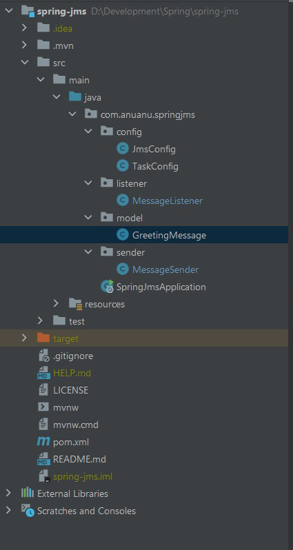

## Ejemplo 03: Spring JMS

### OBJETIVO

- Recibir un objeto en el cuerpo de una petición HTTP POST


### DESARROLLO

JMS es una API Java estándar que permite que una aplicación Java envíe mensajes a otra aplicación. Es altamente escalable y nos permite acoplar libremente aplicaciones usando mensajería asíncrona. Usando JMS podemos leer, enviar y leer mensajes.

Aquí hay algunas implementaciones de JMS como sigue: 

- Amazon SQS
- Apache Active MQ
- Mensajería JBoss
- ConejoMQ

#### Mensajes JMS

Un mensaje JMS se puede dividir en tres partes que son las siguientes:  

- Encabezado: Contiene los metadatos sobre el mensaje.
- Propiedades: se puede subdividir en tres secciones:
   - Aplicación: El mensaje de envío de la aplicación java.
   - Proveedor: lo utiliza el proveedor JMS y es específico de la implementación.
   - Propiedades estándar: están definidas por la API de JMS.
- Carga útil: este campo es el mensaje en sí.

Implementación: aquí crearemos una aplicación de saludo de muestra ( basada en Maven ) para demostrar cómo integrar y usar JMS. Para simplificar, utilizaremos un servidor integrado en lugar de crear otra aplicación.

1. Cree un proyecto de Spring usando el Spring initilzr. Cree las carpetas y los archivos como se muestra en la siguiente estructura de la siguiente manera: 



2. agregue las siguientes dependencias al archivo pom.xml.

```xml
<dependency>
        <groupId>org.apache.activemq</groupId>
        <artifactId>artemis-server</artifactId>
    </dependency>
    <dependency>
        <groupId>org.apache.activemq</groupId>
        <artifactId>artemis-jms-server</artifactId>
    </dependency>
    <dependency>
        <groupId>org.springframework.boot</groupId>
        <artifactId>spring-boot-starter-artemis</artifactId>
    </dependency>
    <dependency>
        <groupId>org.springframework.boot</groupId>
        <artifactId>spring-boot-starter-web</artifactId>
    </dependency>

    <dependency>
        <groupId>org.springframework.boot</groupId>
        <artifactId>spring-boot-devtools</artifactId>
        <scope>runtime</scope>
        <optional>true</optional>
    </dependency>
    <dependency>
        <groupId>org.projectlombok</groupId>
        <artifactId>lombok</artifactId>
        <optional>true</optional>
    </dependency>
    <dependency>
        <groupId>org.springframework.boot</groupId>
        <artifactId>spring-boot-starter-test</artifactId>
        <scope>test</scope>
    </dependency>
```

3. Cree un POJO simple (clase Java antigua simple) que actuará como nuestro modelo para enviar y recibir mensajes. Aquí hemos usado Lombok para reducir el código repetitivo, en este momento no profundizaremos mucho en el uso de Lombok, pues es un tema para las siguientes sesiones. Sin embargo se usan las siguientes anotaciones:

 - `@Data`: esta anotación genera getters, setters para todos los campos, el método toString y el método equals & hashCode.
- `@Builder`: esta anotación utiliza un patrón de compilador para compilar automáticamente API de compilador complejas.
- `@NoArgsConstructor`: esta anotación genera un constructor sin argumentos.
- `@AllArgsConstructor`: esta anotación genera un constructor con todos los argumentos.


```java
// Java Program to Illustrate Model Layer

package com.anuanu.springjms.model;

// Importing required classes
import java.io.Serializable;
import java.util.UUID;
import lombok.AllArgsConstructor;
import lombok.Builder;
import lombok.Data;
import lombok.NoArgsConstructor;

// Annotation
@Data
@Builder
@NoArgsConstructor
@AllArgsConstructor

// Class
// Implementing Serializable interface
public class GreetingMessage implements Serializable {

    // Class data members
    static final long serialVersionUID
        = -7462433555964441775L;
    private UUID id;
    private String message;
}
```

Las configuraciones requeridas son las siguientes: 

#### Configuración del servidor integrado

Como se discutió anteriormente, crearemos un servidor integrado para la demostración de la mensajería JMS. Usaremos ActiveMQServers para crear nuestro servidor incorporado.

El servidor incorporado también se inicia cuando se inicia nuestra aplicación Spring Boot. (como hemos llamado al método start() en el servidor).

```java
// Java Program to Illustrate Embedded Server Configuration

package com.anuanu.springjms;

// Importing required classes
import org.apache.activemq.artemis.core.config.impl.ConfigurationImpl;
import org.apache.activemq.artemis.core.server.ActiveMQServer;
import org.apache.activemq.artemis.core.server.ActiveMQServers;
import org.springframework.boot.SpringApplication;
import org.springframework.boot.autoconfigure.SpringBootApplication;

@SpringBootApplication
public class SpringJmsApplication {

    // Main driver method
    public static void main(String[] args) throws Exception
    {

        // Embedded Server Configuration
        ActiveMQServer activeMQServer
            = ActiveMQServers.newActiveMQServer(
                new ConfigurationImpl()
                    .setPersistenceEnabled(false)
                    .setJournalDirectory(
                        "target/data/journal")
                    .setSecurityEnabled(false)
                    .addAcceptorConfiguration("invm",
                                            "vm://0"));

        activeMQServer.start();
        SpringApplication.run(SpringJmsApplication.class,
                            args);
    }
}
```
#### Configuración de tareas
La clase taskConfig nos ayudará a ejecutar tareas de forma asíncrona. La tarea aquí es enviar mensajes a intervalos fijos de tiempo. Para enviar mensajes a intervalos fijos, hemos habilitado el programador mediante la anotación `@EnableScheduling`. Las anotaciones utilizadas son las siguientes: 

- `@EnableScheduling`: esta anotación habilita el programador para nuestra aplicación.
- `@EnableAsync`: esta anotación permite que Spring ejecute métodos `@Async` en un grupo de subprocesos en segundo plano.
- `@Configuration`: esta anotación indica que la clase especificada tiene métodos de definición de `@Bean`.
 - `@Bean`: es una anotación a nivel de método y se usa para declarar explícitamente un bean.


```java
// Java Program to Illustrate Task Configuration

package com.anuanu.springjms.config;

// Importing required classes
import org.springframework.context.annotation.Bean;
import org.springframework.context.annotation.Configuration;
import org.springframework.core.task.SimpleAsyncTaskExecutor;
import org.springframework.core.task.TaskExecutor;
import org.springframework.scheduling.annotation.EnableAsync;
import org.springframework.scheduling.annotation.EnableScheduling;

// Annotations
@EnableScheduling
@EnableAsync
@Configuration

// Class
public class TaskConfig {

    // Task Configuration
    @Bean TaskExecutor taskExecutor()
    {
        return new SimpleAsyncTaskExecutor();
    }

    // taskExecutor bean is injected into spring context,
    // and spring will use it to execute tasks for us
}
```

#### Configuración del convertidor de mensajes
La clase jmsConfig proporciona un flujo común para productores y consumidores para producir y consumir mensajes respectivamente. También proporciona un bean para convertir objetos Java y mensajes JMS. Las anotaciones utilizadas son las siguientes:

- `@Configuration` : esta anotación indica que la clase especificada tiene métodos de definición de `@Bean`.
- `@Bean` : es una anotación a nivel de método y se usa para declarar explícitamente un bean.

```java
// Java Program to Illustrate Task Configuration

package com.anuanu.springjms.config;

// Importing required classes
import org.springframework.context.annotation.Bean;
import org.springframework.context.annotation.Configuration;
import org.springframework.jms.support.converter.MappingJackson2MessageConverter;
import org.springframework.jms.support.converter.MessageConverter;
import org.springframework.jms.support.converter.MessageType;

// Annotations
@Configuration

// Class
public class JmsConfig {

    // Class data member
    public static final String QUEUE = "greet";

    // Annotation
    @Bean

    // Class
    public MessageConverter messageConverter()
    {

        MappingJackson2MessageConverter converter
            = new MappingJackson2MessageConverter();
        converter.setTargetType(MessageType.TEXT);
        converter.setTypeIdPropertyName("_type");

        return converter;
    }

    // Enabling spring to take jms messages and flip it
    // to a json message. then it can read
    // that jms message as a jms text message and
    // convert it back to java object
}
```

#### Envío de mensajes JMS

La clase MessageSender ( descrita a continuación ) se usa principalmente para crear y producir/enviar mensajes al flujo común desde donde el consumidor puede consumir mensajes. Hemos utilizado JmsTemplate, que es una clase auxiliar que nos facilita recibir y enviar mensajes a través de JMS. También hemos anotado la clase con @Scheduled con un valor de 2000 ms que le dice al programador que envíe los mensajes en un intervalo de cada 2 segundos. Las anotaciones utilizadas son las siguientes: 

- `@RequiredArgsConstructor`: esta anotación genera un constructor con los argumentos requeridos, es decir. argumentos con campos finales o campos con otras restricciones.
- `@Component`: esta anotación marca nuestra clase como el componente que permite que Spring detecte cualquier bean definido de forma personalizada.
- `@Scheduled`:  esta anotación marca un método para programarlo. Debe tener cualquiera de estos atributos cron(), fixedDelay() o fixedRate().

```java
// Java Program to Illustrate Sending JMS Messages

package com.anuanu.springjms.sender;

// Importing required classes
import com.anuanu.springjms.config.JmsConfig;
import com.anuanu.springjms.model.GreetingMessage;
import java.util.UUID;
import lombok.RequiredArgsConstructor;
import org.springframework.jms.core.JmsTemplate;
import org.springframework.scheduling.annotation.Scheduled;
import org.springframework.stereotype.Component;

// Annotations
@RequiredArgsConstructor
@Component

// Class
public class MessageSender {

    // Class data member
    private final JmsTemplate jmsTemplate;
    private static Integer ID = 1;

    // Annotation
    @Scheduled(fixedRate = 2000)

    // Method
    public void sendMessage()
    {
        // Display command
        System.out.println("Greetings user");

        GreetingMessage message
            = GreetingMessage.builder()
                .id(UUID.randomUUID())
                .message("Greetings user " + ID++)
                .build();

        jmsTemplate.convertAndSend(JmsConfig.QUEUE,
                                message);

        // Display command
        System.out.println("Message sent!!!");
    }
}
```

#### Recibir mensajes JMS
La clase MessageListener (descrita a continuación) actúa como un consumidor, es decir, consume/recibe mensajes que residen en el flujo común y aún no se han consumido. La ubicación del flujo común "JmsConfig.QUEUE" se pasa al método de destino en @JmsListener. Las anotaciones utilizadas son las siguientes: 

- `@JmsListener`: esta anotación marca un método para que sea el destino de un detector de mensajes JMS en el destino especificado ().
- `@Component`: esta anotación marca nuestra clase como componente, lo que permite que Spring detecte cualquier bean definido de forma personalizada.
- `@Payload`: esta anotación marca que la carga útil del mensaje que se va a extraer es un parámetro anotado.
- `@Headers`: esta anotación extrae todos los encabezados dentro de `Map<String, Object>`. Se usa aquí con la clase MessageHeaders que implementa `Map<String, Object>` y se usa para encabezados de mensajes.


```java
// Java Program to Illustrate Receiving JMS Messages

package com.anuanu.springjms.listener;

// Importing required classes
import com.anuanu.springjms.config.JmsConfig;
import com.anuanu.springjms.model.GreetingMessage;
import javax.jms.Message;
import org.springframework.jms.annotation.JmsListener;
import org.springframework.messaging.MessageHeaders;
import org.springframework.messaging.handler.annotation.Headers;
import org.springframework.messaging.handler.annotation.Payload;
import org.springframework.stereotype.Component;

// Annotation
@Component

// Class
public class MessageListener {

    @JmsListener(destination = JmsConfig.QUEUE)

    public void
    listen(@Payload GreetingMessage greetingMessage,
        @Headers MessageHeaders messageHeaders,
        Message message)
    {

        // Display command
        System.out.println("Greeting Received!!!");

        System.out.println(greetingMessage);
    }
}
```

El mensaje se envía y recibe cada 2 segundos. Se pasa un nombre de usuario y una identificación únicos para cada mensaje nuevo.

